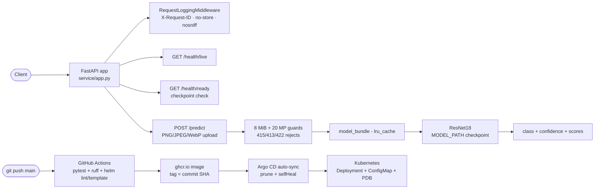

# Visual defect classification

[Architecture](docs/architecture.md) · [Operations runbook](docs/operations.md) · [Helm chart](k8s/helm/visual-defect-service/) · [Argo CD application](k8s/argocd/application.yaml)

## Overview

Image classification for visual defect detection with PyTorch transfer learning. A frozen ImageNet ResNet18 backbone is fine-tuned on the classifier head with split-leakage checks (byte-identical images rejected across splits), early stopping, and best-validation-loss checkpointing. The serving API is bounded: uploads are limited to 8 MiB and 20 million decoded pixels, only PNG/JPEG/WebP are accepted, and malformed images are rejected before the model loads. Readiness is artifact-checked — a missing or incompatible checkpoint returns 503.

This is a **reference implementation**: it has not been deployed to a production cluster and makes no claims about domain data or inspection quality.

## Architecture



See [docs/architecture.md](docs/architecture.md) for request/model boundaries and [docs/operations.md](docs/operations.md) for the operator runbook.

## Measured results

Engineering measurements taken 2026-09-23 on this machine (local Linux, CPU). No business or quality metrics are claimed.

- **Tests:** 4 passed, 0 failed — `python -m pytest -q`.
- **Lint:** `ruff check .` — 0 findings (ruff 0.16.7).
- **API latency** (local uvicorn, randomly-initialized ResNet18 checkpoint — latency only, not a quality claim): `POST /predict` — p50 46.8ms, p95 66.7ms (n=150, 10 warmup requests, local uvicorn).
- **Helm:** `helm lint --strict` passed; `helm template` rendered in default and `--set autoscaling.enabled=true --set networkPolicy.enabled=true` modes; rendered manifests passed kubeconform strict schema validation (Kubernetes 1.30 schemas). Not applied to a live cluster.

## Setup

```sh
python -m venv .venv && source .venv/bin/activate
python -m pip install -e '.[test]'
python -m pytest -q
ruff check .
```

## Usage

Train (dataset layout `root/train/<class>/*.png` and `root/val/<class>/*.png`; class sets must match):

```sh
python -m service.deep_learning /path/to/dataset --output artifacts/vision-model.pt
```

Serve (mount the reviewed checkpoint read-only):

```sh
MODEL_PATH=/models/vision-model.pt uvicorn service.app:app --host 127.0.0.1 --port 8000
```

Predict:

```sh
curl -s -X POST http://127.0.0.1:8000/predict \
  -F 'file=@sample.png;type=image/png'
# {"class":"good","confidence":0.61,"scores":{"good":0.61,"defect":0.39}}
```

Health checks:

```sh
curl -s http://127.0.0.1:8000/health/live   # {"status":"alive"}
curl -s http://127.0.0.1:8000/health/ready  # {"status":"ready"} or 503
```

## API reference

| Method | Path | Description |
| ------ | ---- | ----------- |
| GET | `/health/live` | Process liveness — `{"status":"alive"}` |
| GET | `/health/ready` | 200 `{"status":"ready"}` when the checkpoint loads; 503 otherwise |
| POST | `/predict` | Multipart `file` (PNG/JPEG/WebP, ≤8 MiB, ≤20M pixels) → `{"class", "confidence", "scores"}`; 415/413/422 on invalid uploads; 503 if the checkpoint is unavailable |

Every response carries `X-Request-ID`, `Cache-Control: no-store`, and `X-Content-Type-Options: nosniff`. Request logs record method, path, status, request ID, and duration — never bodies or query strings.

## Deployment

**Docker:** `docker build -t ghcr.io/saimudunuri04/visual-defect-service:<tag> .` — the CPU-serving image runs `uvicorn service.app:app` on port 8000 as non-root UID 10001 (training can use a separate GPU environment). CI builds and pushes the image on every `main` push with two tags — the tested commit SHA (immutable) and `latest` (rolling).

**Helm:** the single chart at `k8s/helm/visual-defect-service/` renders a Deployment (rolling update, startup/readiness/liveness probes), Service, ServiceAccount, ConfigMap (`values.appEnv` → `MODEL_PATH`), PDB, and optional HPA and NetworkPolicy.

```sh
helm lint k8s/helm/visual-defect-service --strict
helm template visual-defect-service k8s/helm/visual-defect-service --namespace visual-defect-service
helm template visual-defect-service k8s/helm/visual-defect-service --namespace visual-defect-service \
  --set autoscaling.enabled=true --set networkPolicy.enabled=true
```

**Argo CD GitOps:** push to `main` → CI (pytest, ruff, helm lint/template) tests → Docker build + push to ghcr.io (tags: commit SHA and `latest`) → `values.yaml` image tag pinned to the tested SHA → Argo CD (`k8s/argocd/application.yaml`) detects the chart change and auto-syncs with prune and selfHeal. Manifests were validated with `helm lint --strict`, `helm template`, and kubeconform strict schema validation; they have **not** been applied to a live cluster. A domain-specific evaluation set and GPU/CPU sizing review are required before any real deployment.

## Project structure

```
visual-defect-service/
├── src/service/
│   ├── app.py            # FastAPI API, bounded uploads, cached model bundle, /predict
│   ├── deep_learning.py  # ResNet18 fine-tuning CLI: split checks, early stopping
│   └── observability.py  # request-ID middleware, security headers, JSON logs
├── tests/                # pytest: split guards, 503 readiness, upload rejection
├── docs/                 # architecture.md, operations.md
├── k8s/helm/visual-defect-service/  # Chart, values, schema, templates, NOTES
├── k8s/argocd/application.yaml      # Argo CD app (placeholders documented inline)
├── Dockerfile            # CPU-serving image, non-root
├── pyproject.toml
└── LICENSE               # MIT
```

## CI status

`.github/workflows/ci.yml` — **test-build**: `ruff check .`, `pytest -q`, `helm lint --strict`, and `helm template` in both default and autoscaling+networkPolicy modes. **publish** (on `main`): builds and pushes `ghcr.io/saimudunuri04/visual-defect-service:<commit-sha>` and `ghcr.io/saimudunuri04/visual-defect-service:latest`, then pins the SHA tag in `values.yaml` so Argo CD syncs exactly the tested commit.

## License

MIT — see [LICENSE](LICENSE).
